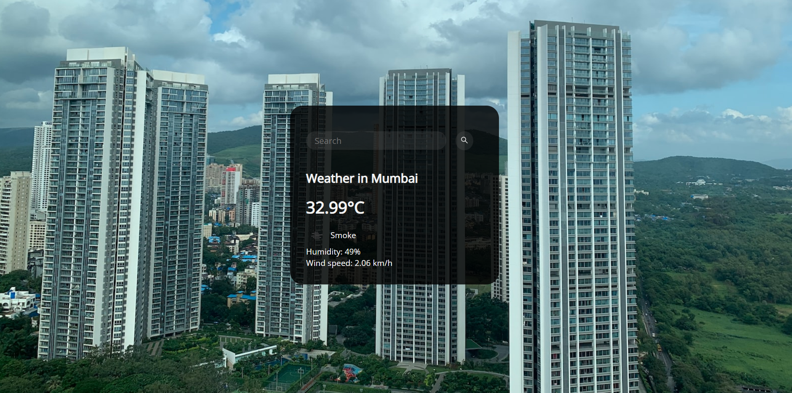

# Weather Website



Welcome to the Weather Website project! This simple web application provides users with current weather information for a specific location. It's built using HTML, CSS, and JavaScript, making it easy to understand and modify.

## Features

- **Current Weather**: Get real-time weather information for a location.
- **Beautiful Background**: Enjoy a dynamic background that changes based on the weather condition.

## Live Demo

You can access the live website by clicking [here](https://ritzykings.github.io/Weather_Website/).

## Project Structure

The project consists of the following files:

- **`index.html`**: The main HTML file for the website's structure.
- **`script.js`**: The JavaScript file for fetching and displaying weather data.
- **`style.css`**: The CSS file for styling the website.
- **`Weather_background.png`**: The background image for the website.

## Usage

1. Clone this repository to your local machine using `git clone`.
   ```bash
   git clone https://github.com/RitzyKingS/Weather_Website.git
   ```
2. Open the `index.html` file in your web browser.
3. Enter the location for which you want to check the weather.
4. Click the "Get Weather" button to view the weather details.

## How it Works

The website uses the [OpenWeatherMap API](https://openweathermap.org/) to fetch weather data for the specified location. The background image changes dynamically to represent the current weather condition, making the website more visually appealing.

## Customization

You can customize this project by:

- Modifying the CSS in `style.css` to change the website's appearance.
- Improving the user interface or adding more features.

## License

This project is licensed under the MIT License - see the [LICENSE](LICENSE) file for details.

## Acknowledgments

- Thanks to [OpenWeatherMap](https://openweathermap.org/) for providing the weather data.
- Background image sourced from [Unsplash](https://unsplash.com).
